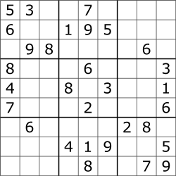

# Sudoku kata

El **Sudoku** es un rompecabezas de números muy popular.

El objetivo es rellenar una cuadrícula de 9 x 9 con números de modo que cada columna, cada fila y cada una de las nueve regiones de 3 x 3 que componen la cuadrícula contengan todos los dígitos del 1 al 9.

El punto de partida es una cuadrícula parcialmente completada:
<p align="center">
    
</p>

La cuadrícula terminada se vería así:
<p align="center">
    
</p>

## Reglas
- Todos los números del rango deben estar presentes en todas las filas, columnas y regiones.
- Dentro de una fila, columna y región no puede haber ningún número repetido.

Los siguientes son ejemplos de errores:
<p align="center">
    
</p>
<p align="center">
    
</p>
<p align="center">
    
</p>
Ninguna de estas opciones puede estar presente en una solución valida

## Instrucciones
Crea una aplicación capaz de determinar si una matriz es una solución potencial para un Sudoku.

El input es la ruta de un archivo **CSV** que contiene **N** filas y **N** números por fila, donde **N** es el cuadrado de un número entero, **N** debe ser mayor que 3 (4,9,16,25,...):

<p align="center">
   <em>1, 2, 3, 4,</em>
</p>
<p align="center">
   <em>2, 1, 4, 3,</em>
</p>
<p align="center">
   <em>3, 4, 1, 2,</em>
</p>
<p align="center">
   <em>4, 3, 2, 1,</em>
</p>
<p align="center">
<b>N = 4</b>
</p>

</br>

<p align="center">
   <em>1, 2, 3, 4, 5, 6, 7, 8, 9,</em>
</p>
<p align="center">
   <em>1, 2, 3, 4, 5, 6, 7, 8, 9,</em>
</p>
<p align="center">
   <em>1, 2, 3, 4, 5, 6, 7, 8, 9,</em>
</p>
<p align="center">
   <em>1, 2, 3, 4, 5, 6, 7, 8, 9,</em>
</p>
<p align="center">
   <em>1, 2, 3, 4, 5, 6, 7, 8, 9,</em>
</p>
<p align="center">
   <em>1, 2, 3, 4, 5, 6, 7, 8, 9,</em>
</p>
<p align="center">
   <em>1, 2, 3, 4, 5, 6, 7, 8, 9,</em>
</p>
<p align="center">
   <em>1, 2, 3, 4, 5, 6, 7, 8, 9,</em>
</p>
<p align="center">
   <em>1, 2, 3, 4, 5, 6, 7, 8, 9,</em>
</p>
<p align="center">
<b>N = 9</b>
</p>

### Ejemplo

Un archivo que contiene:
<p align="center">
   <em>1, 2, 3, 4,</em>
</p>
<p align="center">
   <em>2, 1, 4, 3,</em>
</p>
<p align="center">
   <em>3, 4, 1, 2,</em>
</p>
<p align="center">
   <em>4, 3, 2, 1,</em>
</p>

El output debería ser:

```
El input no cumple las reglas de Sudoku
```
</br>

Un archivo que contiene:
<p align="center">
   <em>1, 2, 3, 4,</em>
</p>
<p align="center">
   <em>3, 4, 1, 2,</em>
</p>
<p align="center">
   <em>2, 3, 4, 1,</em>
</p>
<p align="center">
   <em>4, 1, 2, 3,</em>
</p>

El output debería ser:

```
El input cumple con las reglas de Sudoku
```